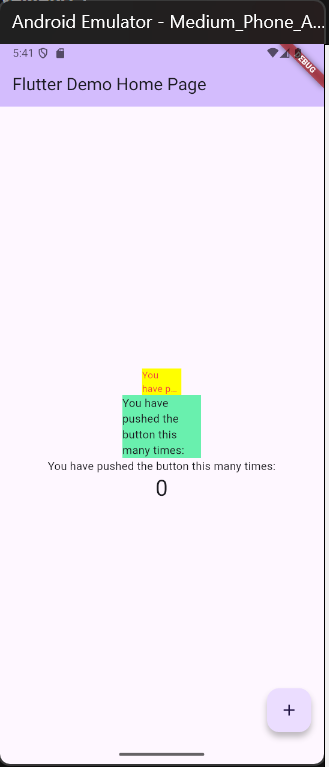

# #06 | Manajemen Plugin
## Praktikum Menerapkan Plugin di Project Flutter
### Langkah 1: Buat Project Baru
Buatlah sebuah project flutter baru dengan nama flutter_plugin_pubdev. Lalu jadikan repository di GitHub Anda dengan nama flutter_plugin_pubdev.

### Langkah 2: Menambahkan Plugin
Tambahkan plugin auto_size_text menggunakan perintah berikut di terminal

Jika berhasil, maka akan tampil nama plugin beserta versinya di file pubspec.yaml pada bagian dependencies.

.png)

### Langkah 3: Buat file red_text_widget.dart
Buat file baru bernama red_text_widget.dart di dalam folder lib lalu isi kode seperti berikut.

### Langkah 4: Tambah Widget AutoSizeText
Masih di file red_text_widget.dart, untuk menggunakan plugin auto_size_text, ubahlah kode return Container() menjadi seperti berikut.

Setelah Anda menambahkan kode di atas, Anda akan mendapatkan info error. Mengapa demikian? Jelaskan dalam laporan praktikum Anda!

Error terjadi karena variabel text belum didefinisikan di dalam class RedTextWidget

### Langkah 5: Buat Variabel text dan parameter di constructor
Tambahkan variabel text dan parameter di constructor seperti berikut.

### Langkah 6: Tambahkan widget di main.dart
Buka file main.dart lalu tambahkan di dalam children: pada class _MyHomePageState

Run aplikasi tersebut dengan tekan F5, maka hasilnya akan seperti berikut.

## Tugas Praktikum
1. Selesaikan Praktikum tersebut, lalu dokumentasikan dan push ke repository Anda berupa screenshot hasil pekerjaan beserta penjelasannya di file README.md!

2. Jelaskan maksud dari langkah 2 pada praktikum tersebut!
 Jawab: Menambahkan plugin ke proyek dengan cara menjalankan perintah flutter pada terminal  

3. Jelaskan maksud dari langkah 5 pada praktikum tersebut!
 Jawab: Mendefinisikan variabel text agar widget tahu teks apa yang akan ditampilkan, menambahkan parameter di constructor supaya saat RedTextWidget digunakan bisa memberikan nilai text dari luar, dan memastikan nilai text wajib diisi (required), dan tidak bisa berubah (final)sesuai konsep StatelessWidget.

4. Pada langkah 6 terdapat dua widget yang ditambahkan, jelaskan fungsi dan perbedaannya!
 Jawab: Widget pertama (kuning) → menunjukkan kelebihan AutoSizeText
Widget kedua (hijau) → menunjukkan perilaku Text biasa.

5. Jelaskan maksud dari tiap parameter yang ada di dalam plugin auto_size_text berdasarkan tautan pada dokumentasi ini!
 Jawab: 

6. Kumpulkan laporan praktikum Anda berupa link repository GitHub kepada dosen!

